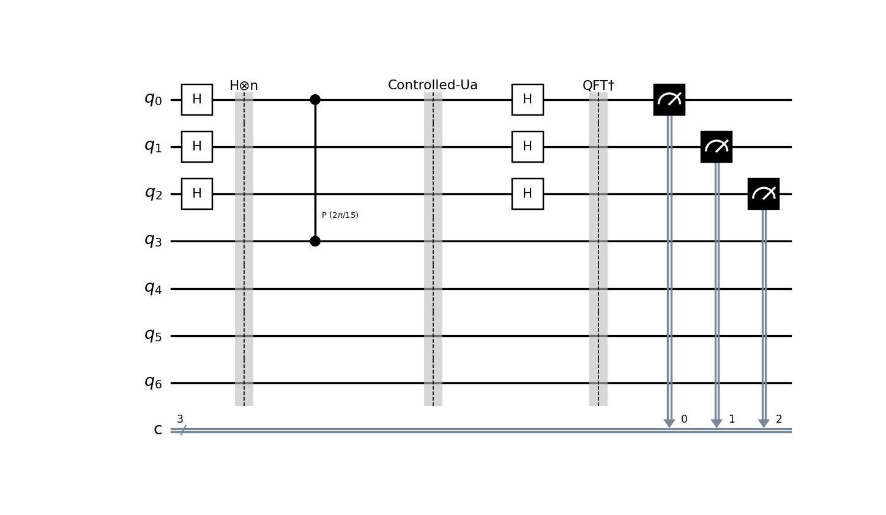
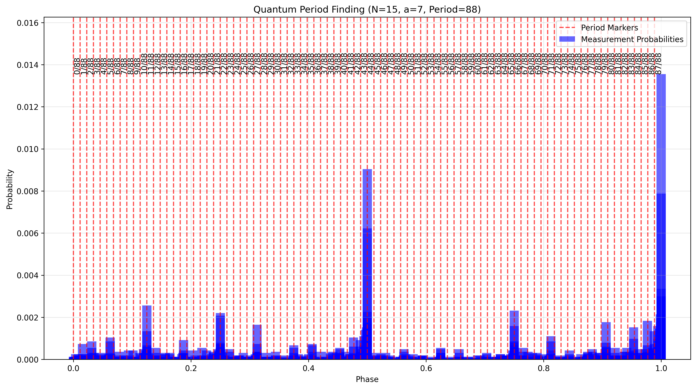
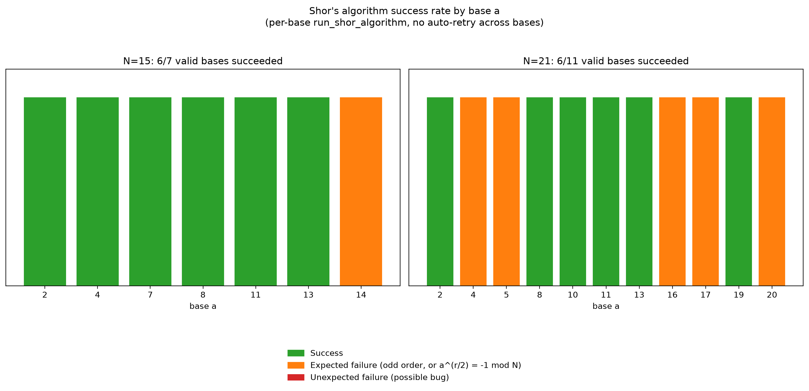

# Shor's Algorithm Project

This project implements Shor's Algorithm, a quantum algorithm for integer factorization, including the full quantum period-finding subroutine: controlled modular exponentiation via explicit unitary construction, an inverse Quantum Fourier Transform, and continued-fraction-based period extraction from the measured phases (not a classical fallback dressed up as a quantum circuit). The purpose of the project is to provide a genuine, independently-verifiable implementation with visualizations to help understand its key components.

## The problem, in plain terms

Every composite number is built out of a unique set of prime factors, and finding them is easy to state but brutally slow to actually do. Trial division, checking 2, then 3, then 5, and so on, works fine for small numbers, but the amount of work grows explosively as the number of digits grows. This asymmetry is exactly what modern encryption leans on: multiplying two huge prime numbers together to get $N$ is cheap, but for a classical computer, factoring that $N$ back apart is, for numbers with hundreds of digits, practically impossible in any reasonable amount of time. That gap is the foundation RSA encryption is built on, and it underlies a large share of the internet's security.

Shor's insight was to turn factoring into a completely different kind of problem: finding a hidden period. Pick some number $a$ and look at the sequence of remainders you get from repeatedly multiplying it by itself and dividing by $N$, that is, $a^1 \mod N$, $a^2 \mod N$, $a^3 \mod N$, and so on. That sequence eventually repeats, and the length of the repeating chunk is the period $r$. Finding that period by brute force is just as slow as factoring directly, but it turns out to be exactly the kind of problem a quantum computer is good at: put the counting register in superposition, apply the modular exponentiation, then use a quantum Fourier transform to pull the hidden periodicity straight out of the interference pattern. It's the same "measure something, then use a Fourier transform to extract a hidden period" trick that shows up in Simon's algorithm (a sibling project in this portfolio), just generalized from binary strings to integers. Once you have the period $r$, a small amount of ordinary classical math, a single greatest-common-divisor calculation, turns it into the actual prime factors of $N$.

This implementation is a small-N demonstration (N=15, N=21 scale), not something that can factor cryptographically-large numbers. Simulating the quantum circuit for even a few hundred qubits is already far beyond what a classical computer can do, which is the whole point: the interesting content here is in getting the period-finding subroutine mathematically correct, not in factoring anything large.

## Project Structure

### Files

- **shor_algorithm.py**: Contains the main implementation of Shor's Algorithm, including:
  - Modular exponentiation function.
  - Quantum Fourier Transform (QFT) implementation.
  - The main function to execute Shor's Algorithm and extract factors.

- **visualize_circuit.py**: Provides visualizations of the quantum circuit and plots the probability distribution of measurement outcomes. Includes:
  - Functions to create and display Shor's Algorithm circuits.
  - Probability peak plotting with realistic period markers.

- **success_rate_analysis.py**: Sweeps every valid base $a$ for $N=15$ and $N=21$, runs `run_shor_algorithm(N, a)` for each one, and classifies each outcome as a success, a mathematically expected failure, or an unexpected failure, then plots the results.

- **tests/test_shor_algorithm.py**: Unit tests for validating the correctness of Shor's Algorithm implementation, including regression checks that the inverse QFT is a true inverse and that controlled modular multiplication performs the correct permutation.

- **requirements.txt**: Lists all dependencies required to run the project.

- **LICENSE**: The license file for the project.

- **examples/**: A directory that stores generated output files:
  - `shor_circuit.png`: Visualization of the quantum circuit.
  - `probability_peaks.png`: Histogram showing the probability distribution of measurement outcomes.
  - `success_rate_by_base.png`: Bar chart of success/failure outcomes across every valid base, for N=15 and N=21.

### Graphs

1. **Circuit Diagram**: A clear representation of the Shor's Algorithm quantum circuit, highlighting key stages such as:
   - Application of Hadamard gates.
   - Controlled modular exponentiation.
   - Inverse QFT.

   

2. **Probability Peaks**: A histogram displaying the probability of measured phases. The red dashed lines indicate expected periodicity based on the algorithm's results. This helps visualize the quantum period-finding process and highlights key phases contributing to factorization. Note that these graphs demonstrate probabilities and are best interpreted with multiple runs to mitigate probabilistic noise.

   

3. **Success Rate by Base**: A sweep over every valid base $a$ (every integer $2 \le a < N$ with $\gcd(a, N) = 1$) for $N=15$ and $N=21$, calling `run_shor_algorithm(N, a)` directly for each base (no auto-retry across bases). Each outcome is classified as a success, a mathematically expected failure (the true multiplicative order of $a$ mod $N$ is odd, or $a^{r/2} \equiv -1 \mod N$), or an unexpected failure, generated by `success_rate_analysis.py`.

   

   Measured results: 6 out of 7 valid bases for N=15 succeeded, and 6 out of 11 valid bases for N=21 succeeded. Every single failure in both sweeps matched one of the two mathematically expected failure modes (odd order of a mod N, or a^(r/2) = -1 mod N); no unexpected failures were observed.

## Important Notes

- The project simulates Shor's Algorithm using Qiskit's classical simulator backend. The simulator computes the exact, noiseless statevector, so these are the ideal-case results; real quantum hardware would introduce additional gate and decoherence noise, not remove it, so simulator results here are a best-case reference rather than something hardware would improve on.

- Due to the probabilistic nature of quantum algorithms, outputs may vary between runs. For more consistent results, increase the number of shots or run the simulation multiple times.

## Installation

1. Clone the repository:
   ```bash
   git clone https://github.com/shidsa6/shors-algorithm-project.git
   cd shors-algorithm-project
   ```

2. Install dependencies:
   ```bash
   pip install -r requirements.txt
   ```

## Usage

1. To run Shor's Algorithm:
   ```bash
   python shor_algorithm.py
   ```

2. To visualize the circuit and probability peaks:
   ```bash
   python visualize_circuit.py
   ```

3. To sweep every valid base and measure the success rate (this runs real quantum circuit simulations for every base and takes a few minutes):
   ```bash
   python success_rate_analysis.py
   ```

4. To run unit tests:
   ```bash
   python -m unittest tests/test_shor_algorithm.py
   ```

## License

This project is licensed under the terms of the LICENSE file included in the repository.

---

Feel free to reach out with any questions or suggestions for improvements!
